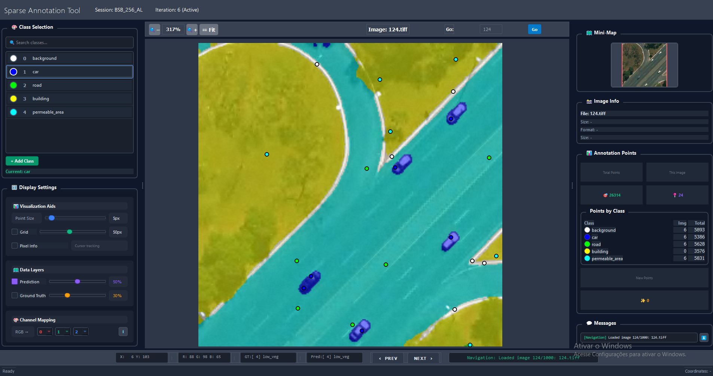
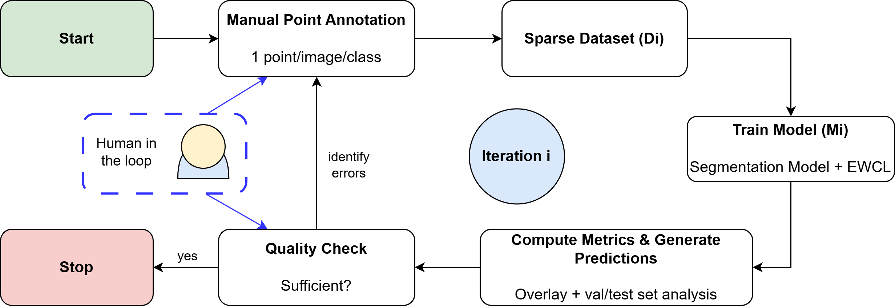
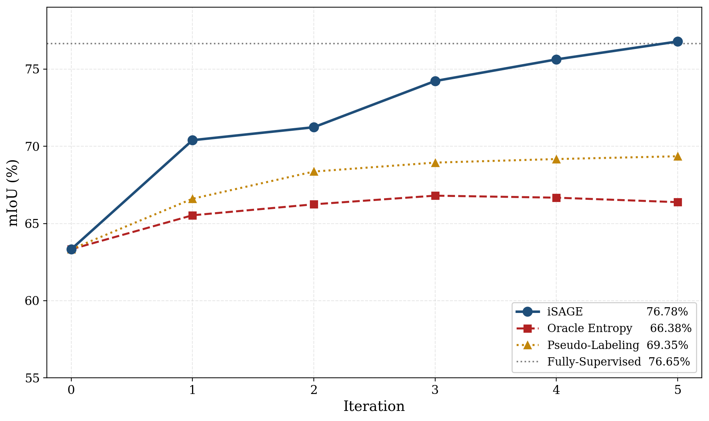

# iSAGE

**Iterative Sparse Annotation Guided by Expert** — train semantic segmentation
models from a handful of expert clicks per image. No pseudo-labels, no
propagation, no consistency machinery between the click and the gradient.

<p align="center">
  
  <br/>
  <em>The iSAGE annotator: prediction overlay, per-class clicks, minimap, point counts.</em>
</p>

The platform packages four subsystems described in
[Carvalho et al. 2026](#citing) (§3.4 of the paper):

| Subsystem | What it does | Where it lives |
|---|---|---|
| Annotation interface | PyQt5 widget showing the image + prediction overlay; left-click adds a point, right-click removes | `isage_annotator/` |
| Record storage | One JSON file per image — auditable, diffable, portable | `Sessions/<name>/iteration_N/annotations/` |
| Session layout | Each iteration is `iteration_N/{annotations,masks,models,predictions}/`; any past state can be reloaded | `src/session/` |
| Training backend | Sparse dataloader (ignore-index for unlabeled pixels) + Error-Weighted Dice Loss + iterative retrain | `src/training/` + vendored `segmentation_models_pytorch/` |

## Quickstart

iSAGE ships with **two drivers** and a programmatic API. Pick the one that
fits your workflow — they share the same session on disk, so you can switch
mid-iteration.

```bash
git clone https://github.com/osmarluiz/iSAGE.git
cd iSAGE
pip install -r requirements.txt
```

### Jupyter (interactive)

```bash
jupyter lab isage_workflow.ipynb
```

Four short cells: imports, a widget that builds the `Workflow` (dataset
dropdown + session picker + iteration selector + "Create new dataset…"
form), then annotate and train.

### Terminal (scriptable)

```bash
# Fast status (no model load, ~0.5s)
python cli.py status --session Sessions/my_run

# One-shot annotate (load model, open GUI, return)
python cli.py annotate --dataset configs/datasets/X.yaml \
                      --training configs/training/Y.yaml \
                      --session Sessions/my_run

# One-shot train
python cli.py train --dataset ... --training ... --session ...

# Interactive REPL (load model once, multiple commands)
python cli.py repl --dataset ... --training ... --session ...
```

### Library (programmatic)

```python
from src.workflow import Workflow

wf = Workflow.from_config(
    dataset='configs/datasets/my.yaml',
    training='configs/training/unet_efficientnet_b7.yaml',
    session='Sessions/my_run',
)
wf.annotate()  # opens the PyQt5 annotator
wf.train()     # trains, generates predictions, advances the iteration
```

### Bring your own trainer

The training backend is pluggable. The default is `SmpTrainer` (U-Net family from `segmentation_models.pytorch` plus EWDL), which is the one the methods paper uses. You can substitute it with your own (PyTorch Lightning, monai, fastai, MMSegmentation, raw PyTorch, anything) by implementing the one-method `Trainer` protocol and passing it to `Workflow`:

```python
from examples.byot.example_trainer import TinyTorchTrainer

wf = Workflow.from_config(
    dataset='configs/datasets/my.yaml',
    training='configs/training/unet_efficientnet_b7.yaml',
    session='Sessions/byot_run',
    trainer=TinyTorchTrainer(num_epochs=5),  # plug your own here
)
wf.annotate()  # annotator unchanged
wf.train()     # delegates to your trainer
```

The annotator, the JSON record format, and the session directory layout stay the same; only the training step changes. See [`docs/bring-your-own-trainer.md`](docs/bring-your-own-trainer.md) for the contract and [`examples/byot/`](examples/byot/) for a working example.

### Try the included example

A 30-patch toy example from the BsB Aerial dataset (5 MB, all 5 classes
represented in every patch) runs the full loop in **about 3 minutes** on a
single GPU:

```bash
python cli.py train \
    --dataset examples/bsb_toy/dataset.yaml \
    --training examples/bsb_toy/training.yaml \
    --session Sessions/bsb_toy_run \
    --iteration 0
```

See [`examples/bsb_toy/README.md`](examples/bsb_toy/README.md) for the full
walkthrough.

## Annotator quick reference

The PyQt5 annotator (launched by cell 3 of the notebook or `python cli.py annotate ...`) is driven mostly by mouse plus a handful of keyboard shortcuts. Full details, including the UI panels and workflow tips, in [`docs/annotator-reference.md`](docs/annotator-reference.md).

**Mouse:**

| Action | Effect |
|---|---|
| Left-click on empty area | Add point of current class |
| Left-click on a point | Drag the point |
| Right-click near a point | Delete that point |
| Middle-click + drag | Pan |
| Wheel | Zoom toward cursor |
| Space + Left-click | Force-add (bypass drag on top of existing point) |

**Keyboard:**

| Key | Effect |
|---|---|
| `1`-`9` | Select class N as the current annotation class |
| `→` / `←` | Next / previous image |
| `Ctrl + +` / `-` / `0` | Zoom in / out / reset |
| `Ctrl + Z` | Undo |
| Hold `P` | Preview prediction overlay (release to hide) |
| Hold `G` | Preview ground-truth overlay (release to hide) |
| `Esc` | Exit (annotations auto-save) |
| `F1` | Help |

## How it works

<p align="center">
  
  <br/>
  <em>Each iteration: human inspects the prediction overlay, clicks on confident errors, re-trains with EWDL, repeat until quality threshold.</em>
</p>

The platform's central thesis: the supervision signal you want comes from
pixels where the model is **confidently wrong**. Acquisition functions over
model outputs (entropy, margin, uncertainty) can't surface those — confident
errors register as confidence by definition. Only a human looking at the
image can. iSAGE's contribution is the workflow that makes this signal
deliverable end-to-end at research scale, plus the Error-Weighted Dice Loss
that amplifies the gradient at every annotated error during training.

## Results

On ISPRS Vaihingen (five classes, 0.011% labeled pixels), iSAGE matches the
fully-supervised baseline trained on dense GT under the same protocol while
the strongest output-reading baselines (oracle entropy and self-training
pseudo-labeling) plateau well below dense.

<p align="center">
  
  <br/>
  <em>mIoU progression on ISPRS Vaihingen. iSAGE: 76.78% at iter 5 (matches fully-supervised 76.65%). Oracle entropy and pseudo-labeling plateau ~8–10 points below.</em>
</p>

Full numbers across both datasets (BsB Aerial multiclass, Vaihingen 5-class,
cross-architecture validation, λ ablation, loss ablation) are in Tables 1–5
of the paper.

## What this platform does NOT do

These omissions are deliberate — they are the experimental thesis of the
paper. Reintroducing them defeats the point.

- No pseudo-labels from model predictions.
- No propagation through CRFs, superpixels, or any spatial heuristic.
- No foundation-model labeling (SAM, CLIPSeg).
- No labeled validation set required (training works without it; see
  `docs/bring-your-own-data.md`).

The four output-reading baselines in `src/annotation/` (entropy oracle,
pseudo-labeling, CRF propagation, uniform random) re-run iSAGE's protocol
with each of these mechanisms in place so the comparison can be made on the
same model, schedule, and seed budget.

## Repository layout

```
.
├── isage_workflow.ipynb       Notebook driver (interactive widget)
├── cli.py                     Terminal driver (REPL + one-shot subcommands)
├── src/
│   ├── workflow.py            Workflow class — the API both drivers use
│   ├── notebook_widgets.py    SessionPicker, dataset-creation form
│   ├── annotation/            Launcher + four output-reading baselines
│   ├── session/               Session management + SessionView + mask generator
│   ├── training/              EWDL training loop + dataloader (val-optional)
│   ├── datasets/, losses/, metrics/, utils/
├── isage_annotator/           PyQt5 annotation GUI
├── segmentation_models_pytorch/   Vendored, modified — contains EWDL
├── configs/
│   ├── datasets/              Per-dataset YAMLs
│   └── training/              Per-experiment YAMLs (paper recipes)
├── examples/bsb_toy/          30-patch BsB subset for quick reproducibility
├── tests/                     Smoke tests (pytest)
├── tools/                     Standalone annotator launcher
└── docs/                      JSON record spec, BYOD guide, EWDL math, smp diff, figures
```

## Hardware

- **Annotation:** any machine with a display (Linux/Mac/Windows; WSL works with X server). PyQt5 + Python 3.9+.
- **Training:** GPU strongly recommended. Paper experiments used a single NVIDIA RTX 4090 with U-Net + EfficientNet-B7. The toy example runs on 4 GB VRAM with B0.

## Citing

If you use iSAGE in academic work, please cite both the platform release and
the methods paper:

```bibtex
@misc{carvalho2026isage,
  title         = {iSAGE: Iterative Sparse Annotation Guided by Expert},
  author        = {Carvalho, Osmar Luiz Ferreira de and others},
  year          = {2026},
  eprint        = {XXXX.XXXXX},
  archivePrefix = {arXiv},
  primaryClass  = {cs.CV}
}
```

A companion **Software Impacts** paper describing this codebase as a research
instrument is planned.

## License

MIT — see `LICENSE`.

The vendored `segmentation_models_pytorch/` directory is a fork of
[qubvel/segmentation_models.pytorch](https://github.com/qubvel/segmentation_models.pytorch)
(also MIT-licensed) with added loss functions, including EWDL. See
[`docs/smp-modifications.md`](docs/smp-modifications.md) for the diff.

The toy example under `examples/bsb_toy/` is a subset of the BsB Aerial
dataset from Carvalho et al. (2022) redistributed under the same MIT terms
as the platform itself.
